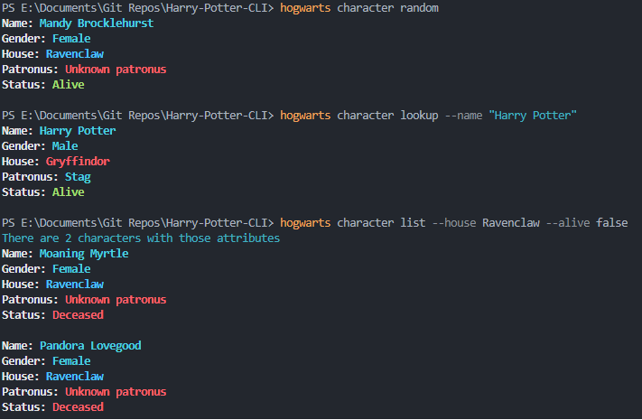

# Harry Potter CLI App  

A Harry Potter CLI tool that knows all spells and characters of the Wizarding World.  

## Installing
### Docker
To install and run locally you can use Docker containers.  
After cloning, use the command:

`docker build -t harry-potter-cli .`

Then you can run each command inside the container e.g. 
- `docker run harry-potter-cli spell random`
- `docker run harry-potter-cli character lookup --name "Cho Chang"`

### Alternate 
After cloning you can simply run the commmands:  

`go build`  
`go install`

Then you can use the CLI commands as seen below.

## CLI Examples 

### Spells
`hogwarts spells` : base command  

Flags:   
`random` : return a random spell   
`lookup --name` : return a spell with the exact name

### Examples

---

### Characters 
`hogwarts character` : base command

Flags:  
`random` : return a random character   
`lookup --name` : return the character with the exact name  
`list [flags]` : return a list of all characters that fit the criteria 

- `--house string`: filter by house
- `--gender string`: filter by gender
- `--patronus string` : filter by patronus
- `--alive bool` : filter by life status

### Examples

